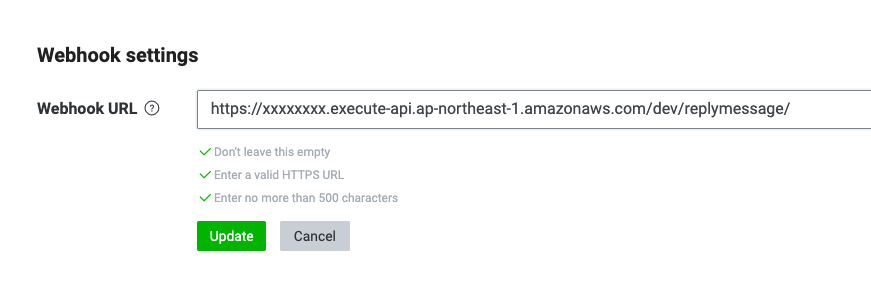

# Operation check

## Configure the Webhook Url

Set the Webhook URL for the Messaging API channel you created in [Create a LINE Channel > Create a channel for the Messaging API].

1. In the [LINE Developers Console](https://developers.line.biz/console/), go to the Messaging API channel you created in [Create a LINE Channel > Create a channel for the Messaging API].

1. Select the Messaging API Settings tab and, in the Webhook URL, enter the API Gateway endpoint that you made a note of in the "Building the Backend > Deploying the App" procedure.

1. The <Use Webhook> setting is displayed, so update it so that it can be used.

## Disable the default response settings.

In addition to the response settings set in the app, the response settings are enabled by default in LINE Official Account Manager, so disable them.

1. In the [LINE Developers Console](https://developers.line.biz/console/), go to the Messaging API channel you created in [Create a LINE Channel > Create a channel for the Messaging API].

1. Select the Messaging API Settings tab, click the Edit Response Message link in the LINE Official Account function, and go to the LINE Official Account Manager.

1. Turn off response messages in LINE Official Account Manager.

# Operation check

After you have completed all the steps, go to [Create a LINE Channel > Create a channel for the Messaging API] and add friends using the QR code displayed on the LINE Messaging API channel you have created.

[Back to Table of Contents](README_en.md)
