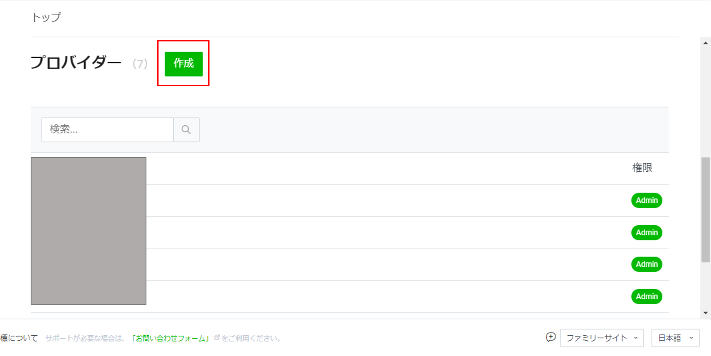
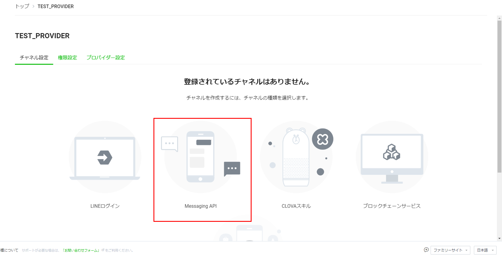
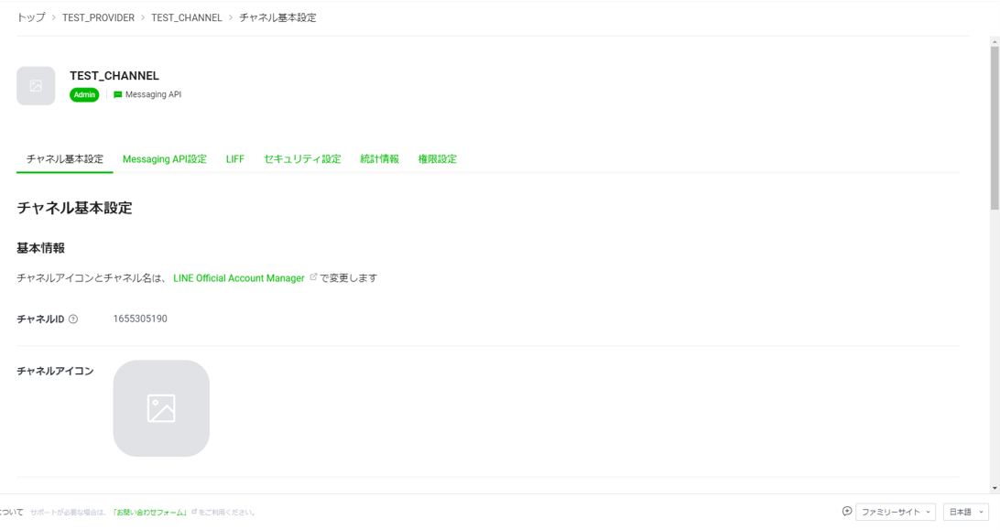

# LINE チャネルの作成

チャネルは開発者が作成したシステムと LINE プラットフォームの通信を行うための通信路です。
本アプリでは以下の LINE チャネルが必要となるので、手順に従って作成してください。

1. MessagingAPI 用 LINE チャネル  
・チャネル作成：https://developers.line.biz/ja/docs/clova-extensions-kit/create-messaging-api-channel-t4/  
・Messaging APIについて：https://lineapiusecase.com/ja/api/msgapi.html  

## 1.LINE アカウントの作成

※LINE アカウントを所持していない場合のみ、こちらの手順を行ってください。

1. 以下リンクのダウンロードより、LINE アプリをダウンロードし、LINE アカウントを作成する  
   https://line.me/ja/

## 2.LINE Developers へのログイン

LINE Developers は本アプリで必要な LINE 公式アカウントの作成や、LIFF アプリの作成を行うための開発者向けサイトです。LINE アカウントを用いて LINE Developers サイトにログインすることで、アプリの開発が可能になります。

1. 以下リンクにアクセスし、ログイン画面に遷移する  
   https://developers.line.biz/ja/
1. 「LINE アカウントでログイン」を行う
1. LINE アカウントに設定したメールアドレスとパスワードの入力を行うか、QR コードログインにより QR コードを別デバイスより読み取ってログインを行う
   ※メールアドレスによるログインを利用したい場合は別途 LINE アプリ側で設定する必要があります。詳細は以下のリンク参照。  
   https://appllio.com/line-mail-address-settings

## 3.プロバイダーの作成

プロバイダーは複数のチャネルを管理するチーム・会社・個人のようなひとまとまりの単位となります。プロバイダーとチャネルは一対多の関係です。

1. LINE Developes にログインした状態で、以下のコンソールに遷移する  
   https://developers.line.biz/console/
2. プロバイダー見出しの横にある作成ボタンを押下する
   
3. 任意のプロバイダー名を入力し、作成を押下する
4. プロバイダーが作成され、以下のような画面に遷移したことを確認する
   

## 4.チャネルの作成

1. Messaging API 用のチャネルを作成
   1. 先ほど作成したプロバイダーの画面にて、Messaging API を押下する
      
   1. 以下の通り、項目を設定する
      1. チャネルの種類： 変更無し
      1. プロバイダー： 変更無し
      1. チャネルアイコン： 変更無し
      1. チャネル名： 任意のチャネル名
         ※チャネル名はエンドユーザーが友達追加する際に表示されるアカウント名となります。後から変更可能です。
      1. チャネル説明： 任意の説明
      1. 大業種： アプリ内容に即した業種
      1. 小業種： アプリ内容に即した業種
      1. メールアドレス: 変更無し
      1. プライバシーポリシー URL： 任意
      1. サービス利用規約 URL： 任意
   1. LINE 公式アカウント利用規約と LINE 公式アカウント API 利用規約に目を通して同意にチェックを入れる
   1. 作成を押下し、チャネルを作成する
   1. 以下画像のような作成したチャネルの画面が表示され、チャネルの作成が完了したことを確認する。
        
      ※チャネル基本設定のタブに表示されているチャネルシークレットを以降の手順にて使用するので、メモを取っておいてください。
   1. Messaging APIのタブに移動し、チャネルアクセストークン（長期）を発行して、メモを取っておく。※後の手順で利用します。

[次の頁へ](richmenu-create.md)

[目次へ戻る](../../README.md)
