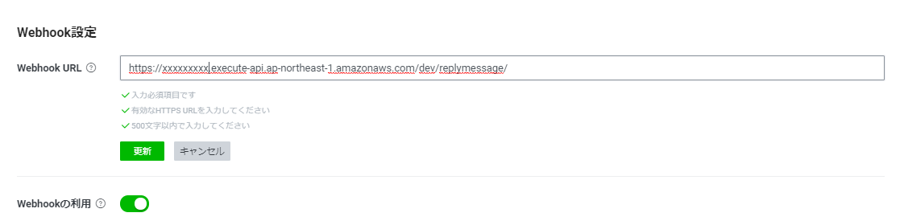

# 動作確認
## Webhook Urlの設定
【LINEチャネルの作成 -> Messaging API 用のチャネルを作成】にて作成したMessaging API用チャネルにWebhook URLを設定します。

1. [LINE Developersコンソール](https://developers.line.biz/console/)にて、【LINEチャネルの作成 -> Messaging API 用のチャネルを作成】にて作成したMessaging APIチャネルのページに遷移する。

1. Messaging API設定のタブを選択し、Webhook URLに、【バックエンドの構築 -> アプリのデプロイ】の手順にてメモを取ったAPI Gateway endpointを入力する。

1. <Webhookの利用>の設定項目が表示されるので、利用する状態に変更する。

## デフォルトの応答設定を無効にする
アプリで設定している応答設定の他に、LINE Official Account Managerにてデフォルトで応答設定が有効になっているため、そちらを無効にします。

1. [LINE Developersコンソール](https://developers.line.biz/console/)にて、【LINEチャネルの作成 -> Messaging API 用のチャネルを作成】にて作成したMessaging APIチャネルのページに遷移する。

1. Messaging API設定のタブを選択し、LINE公式アカウント機能の応答メッセージの編集リンクを押下し、LINE Official Account Managerに移動する。

1. LINE Official Account Managerにて、応答メッセージをオフにする。

## 動作確認
すべての手順が完了後、【LINEチャネルの作成 -> Messaging API 用のチャネルを作成】の手順にて作成したLINE Messaging APIのチャネルに表示されているQRコードから友達登録を行い、動作を確認してください。

[目次へ戻る](../../README.md)
